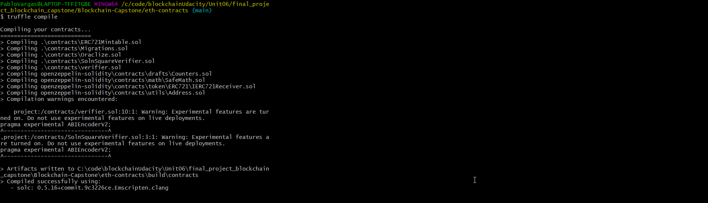
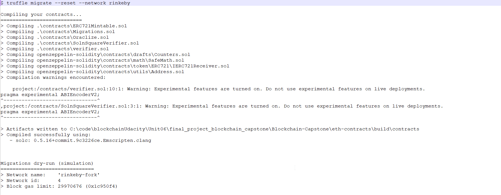
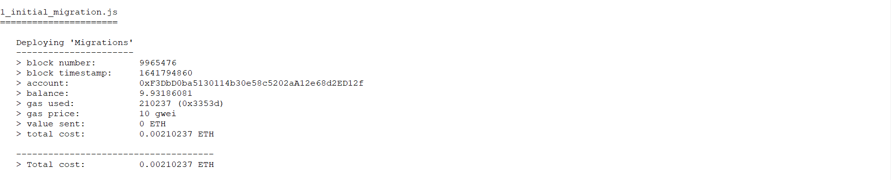
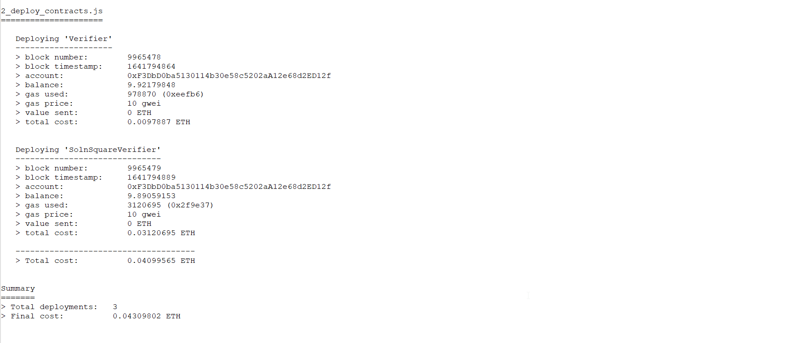
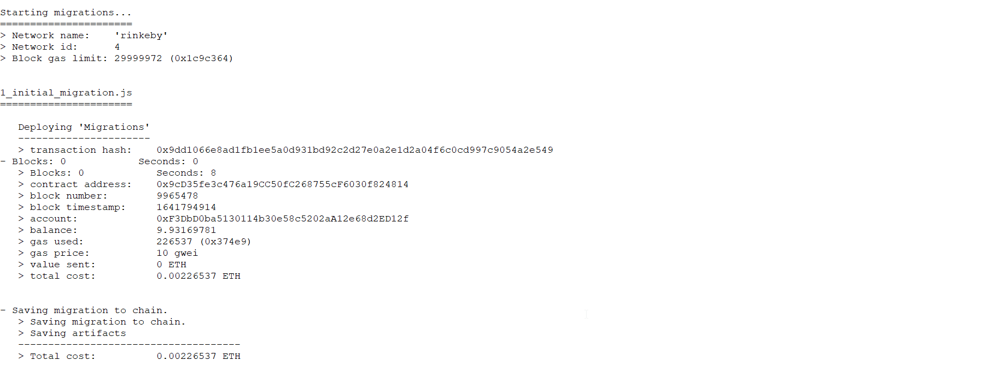
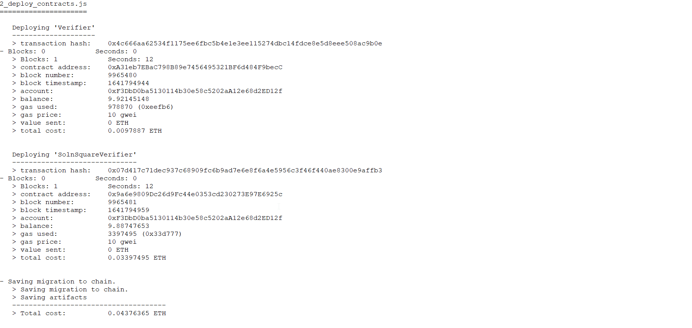
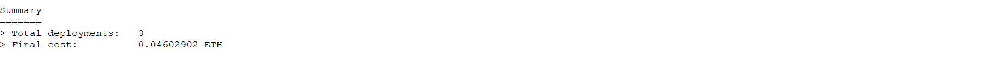
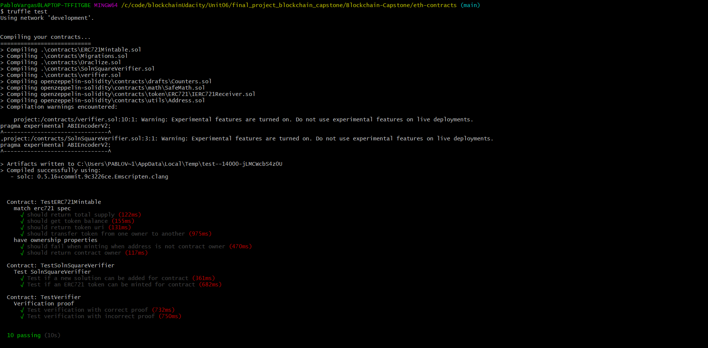

# Udacity Blockchain Capstone

The capstone will build upon the knowledge you have gained in the course in order to build a decentralized housing product. 

## Install
The repository contains Smart Contract code written solidity and tests using Javascript. To run the code:
* npm install
* Truffle Compile (use npx truffle compile if there are issues compiling to use local version of truffle)

## Package versions:
* Truffle v5.0.15 (core: 5.0.15)
* Solidity - 0.5.2 (solc-js)
* Node v14.16.1
* Web3.js v1.5.3

## Generating proof with zokrates
* Navigate to folder zokrates\code\
* Run zokrates docker image docker run -v $(pwd):/home/zokrates/code -it zokrates/zokrates /bin/bash
* compile the program
  cd code
  ~zokrates compile -i square/square.code
* Generate the trusted setup ~/zokrates setup

* Compute witness for your desired pair of number ~/zokrates compute-witness -a 3 9

* Generate proof ~/zokrates generate-proof

* Generate verifier.sol ~/zokrates export-verifier

## Pass Truffle Test using local development blockchain
```
truffle compile
```
All contracts have been compiled as shown below:


```
truffle migrate
```
All migrations have been passed as shown below:







```
truffle test
```
All tests have been passed as shown below:



## Deployed contract address (Verifier) on Rinkeby Testnet
0xA31eb7EBaC798B89e7456495321BF6d484F9becC

## Deployed contract address (SolnSquareVerifier) on Rinkeby Testnet
0x9a6e9809Dc26d9Fc44e0353cd230273E97E6925c

## Owner address
0xF3DbD0ba5130114b30e58c5202aA12e68d2ED12f


# Project Resources

* [Visual Studio Code](https://code.visualstudio.com/)
* [Truffle Framework](https://truffleframework.com/)
* [Ganache - One Click Blockchain](https://truffleframework.com/ganache)
* [Open Zeppelin ](https://openzeppelin.org/)
* [Docker](https://docs.docker.com/install/)
* [ZoKrates](https://github.com/Zokrates/ZoKrates)
